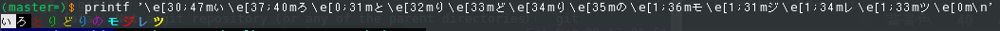
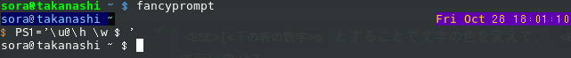

# 付録: ANSIエスケープシーケンスについて

課題とはあまり関係のない話です。日本語がめちゃくちゃにアレなので、ぶっちゃけ自分でググったほうがわかりやすい説はある。

とりあえずタノシイコトをやっているくらいの認識を持っていただければ。

## Q. ANSIエスケープシーケンスって何？

不思議な文字列で、対応している端末であれば「単なる文字」だけでない情報 (色とか)
を付与できるやつだよ。

まあとりあえず論より証拠ということで、次のコマンドをTerminalに打ってみよう (bashを想定) [^1]

```bash:color1.sh
printf '\e[30;47mい\e[37;40mろ\e[0;31mと\e[32mり\e[33mど\e[34mり\e[35mの\e[1;36mモ\e[1;31mジ\e[1;34mレ\e[1;33mツ\e[0m\n'
```

こんな感じでカラフルの文字が表示されましたか？



このように、ESC (上のコードでは\\e) の後にコマンドを続けることで文字に色を付けたり、画面をクリアしたり、Terminalで動画を見たり(!?)することができるようになる、
とってもステキ機能なんだよ！

え？ワクワクしない？そっかあ……ざんねん。

## Q. 課題5向けに書いたコードの説明を

```<ESC>[<下の表の数字>m``` とすることで文字の色を変えて、
```<ESC>[0m``` で元に戻せる。

|        | 黒 | 赤 | 緑 | 黄 | 青 | マゼンタ | シアン | 白 |
|--------|----|----|----|----|----|----------|--------|----|
| 前景色 | 30 | 31 | 32 | 33 | 34 | 35       | 36     | 37 |
| 背景色 | 40 | 41 | 42 | 43 | 44 | 45       | 46     | 47 |

```c:kadai05_show_board.c
if (is_alive(x, y, board)) {
    // 生きているときは白色で表示
    printf("\033[47m  \033[0m");
} else {
    // 死んでいるときは黒色で表示
    printf("\033[40m  \033[0m");
}
```

(Cで\<ESC\>を表すコードは\\033または\\x1b)

つまり、背景色を白色や黒色にして二文字分空白を表示することで、真っ白のマスみたいなものを実現してたっていうだけなのだ。

## Q. これって何に使えるの

一番使われているところは、Terminalのプロンプトかな



無機質だと気が滅入るから、いわゆる **ワタシTerminalチョットデキルマン** [^2]
は、このプロンプトで個性を出していたりするのだ！
 
端末で ```PS1='\[\033[01;32m\]\u@\h\[\033[01;34m\] \w \$\[\033[00m\]'``` って打つとすぐに、カラフルなプロンプトが目の前に！

詳しくは```bash PS1```とかでぐぐろう。```ワタシチョットデキルマン``` たちは ```dotfiles```
という名前でこのPS1の内容含めて公開していたりするので、某たし氏の```.bashrc```とかを見てみると面白いかもかも？

## Q. Terminalで動画を見るってどういうこと？

[libsixel](https://github.com/saitoha/libsixel) ←こちらをどうぞ


[^1]: 残念ながら書いている人は元ネタをプレイしたことないので許してください

[^2]: 元ネタワタシLinuxチョットデキル
