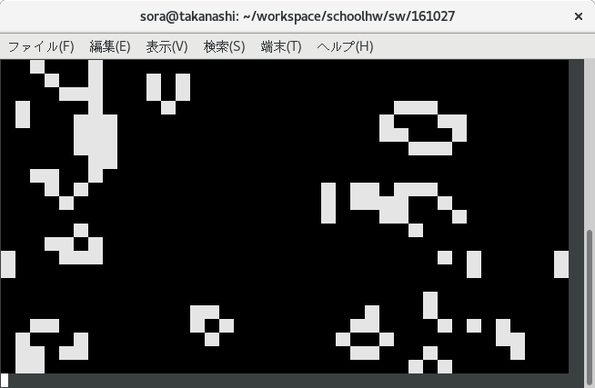

課題5 (ライフゲーム)
=========

所詮おまけ課題ということで、ここに引っかかったよ程度だけ残しておきます。

## 盤面の更新 (世代をすすめる) 時に気をつけないといけないこと

```c:kadai05_update_generation.c
char board[HEIGHT][WIDTH];


for (int y = 0; y < HEIGHT; y++) {
    for (int x = 0; x < WIDTH; x++) {
        int c = 1 /* boardからx,y周辺の生きているセルの数を数える */;
        char next_alive;
        switch (c) {
            case 3:
                next_alive = 1;
                break;
            case 2:
                next_alive = prev[y][x];
                break;
            default:
                next_alive = 0;
        }
        board[y][x] = next_alive;
    }
}
```

のようにboardのあるセルの周辺の生存セルの数を数えて、すぐそのセルを更新すると、ライフゲームにならなくなります。
かならず、周辺の生存セルの数を全部計算してからセルを更新するなり、boardをもう一つ用意して、そっちにnext_aliveを書き込むなりしましょう。
(全体的に日本語力が足りてない)

## ライフゲームとして盤面が見にくい。

どうぞ下のコードを使ってください。

```c:kadai05_show_board.c
if (is_alive(x, y, board)) {
    // 生きているときは白色で表示
    printf("\033[47m  \033[0m");
} else {
    // 死んでいるときは黒色で表示
    printf("\033[40m  \033[0m");
}
```



この ```\033[40m]``` って一体何者やねんという方は、ANSIエスケープシーケンスで調べてみてください。(それっぽく書かれた文書も上げておきます)
